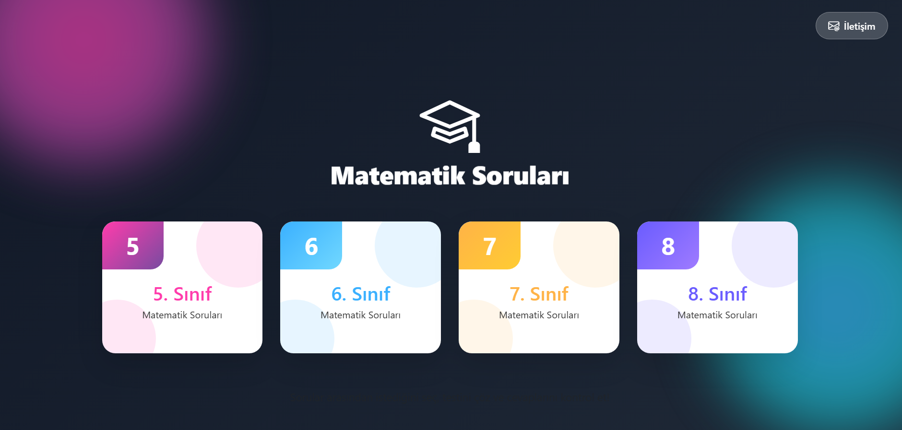
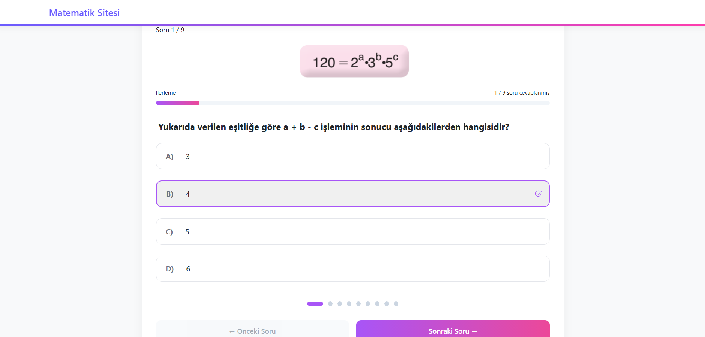
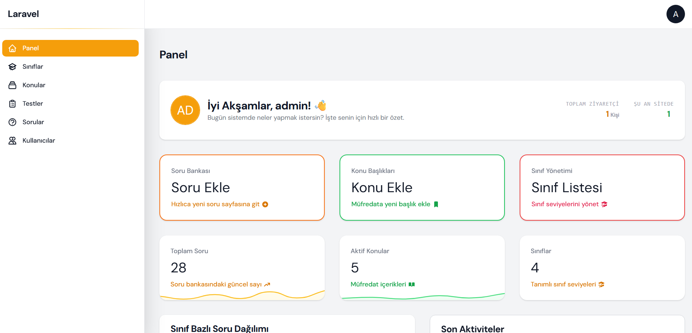

# 🧮 Math Question Bank & Online Quiz Platform

A custom web platform developed for a Mathematics Teacher to manage student quizzes and digital learning resources. Built with the **Laravel** framework, this project focuses on dynamic content delivery and high-efficiency administrative management.

---

## 🛠 Tech Stack
* **Backend:** Laravel (PHP)
* **Admin Panel:** Filament PHP (Advanced CRUD & Resource Management)
* **Frontend:** Bootstrap 5, Custom CSS, JavaScript
* **Database:** MySQL
* **Features:** Dynamic PDF Generation & Online Quiz Engine

---

## 🖼 Project Screenshots
> *Visual overview of the student interface and administration dashboard.*

| Student Quiz Interface | Subject Selection | Admin Dashboard (Filament) |
| :---: | :---: | :---: |
|  |  |  |

*(Note: These are sample views of the platform's core functionality.)*

---

## 🎯 Key Features & Workflow

### 👨‍🏫 Administrative Management (Filament Admin)
* **Hierarchical Content:** Teacher can easily manage Class Levels (5th to 8th grades), Subjects, and Quizzes.
* **Question Bank:** A secure dashboard to create and update questions with images and multiple-choice options.
* **Efficient Operations:** Rapid CRUD actions for managing large volumes of educational data.

### 🎓 Student Features (No Auth Required)
* **Interactive Quizzes:** Students can solve tests online based on their grade and subject.
* **Instant Results:** Real-time scoring upon completing a test.
* **PDF Export:** Students can convert online tests into printable PDF documents for offline practice.

---

## 📈 Technical Highlights
* **MVC Architecture:** Built with clean Laravel standards for scalability.
* **Relational Database:** Structured MySQL schema (Grades -> Subjects -> Tests -> Questions).

---
*Note: Source code is private to protect client confidentiality.*

---
© 2024-2025 Project by Elif Telli.
